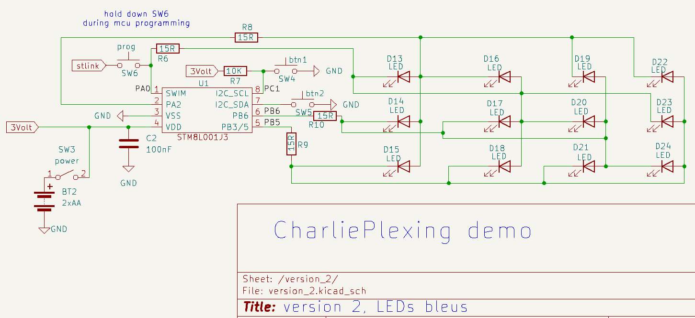

# CharliePlexing demonstration

Using a STM8L001J3 MCU  12 LEDs are multiplexed on 4 I/O

## notes 

1.  Le bouton lorsqu'enfoncé accéllère le multiplexage à environ 83 cycles par seconde pour un scan complet des 12 LEDs. Ce qui donne l'impression qu'elles sont toutes allumées en même temps à cause du phénomène appellé persistance de la vsion.
1.  Les LEDs peuvent être de la couleur de votre choix. Avec un alimentation de 3 volts même les LEDs bleus ou blanches émettent de la lumière.
1. Si des LEDs bleus ou blanches sont utilisées les résistances **R1** à **R4** peuvent être retirées du circuit. Ces LEDs opèrent habituellement à 3.2 volts mais à 3 volts elles consomme environ 15mA ce qui est dans les limites pour les spécifications des E/S  du MCU STM8L001J3 et produit amplement de luminosité.

## Version 2

J'ai construit une version permanente du circuit en faisant quelques modifications. D'abord cette version utilise des DELs bleus et les résistances **R1** à **R4** ont étées remplacées par des 15 ohms. 

Sur les broches 7 et 8 du MCU j'ai ajouter 2 boutons pour sélectionner l'animation active du programme [animation-demo.asm](animation-demo.asm).

